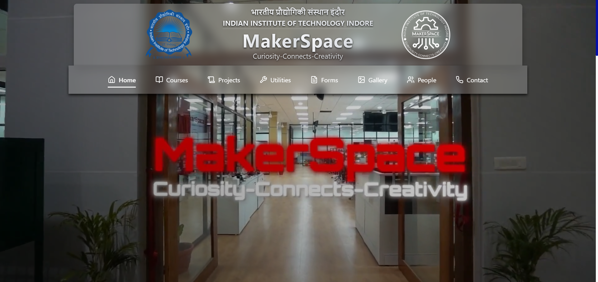
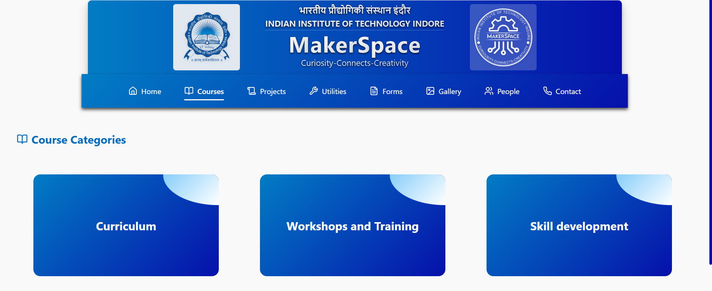
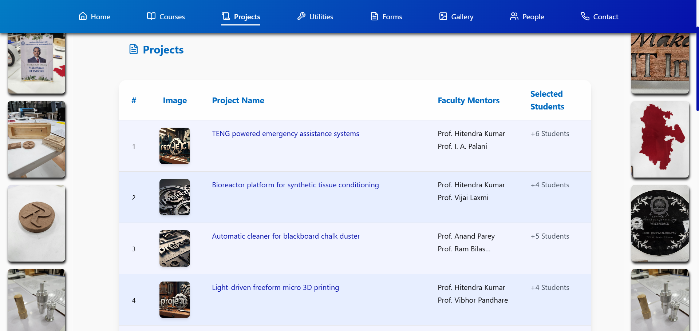
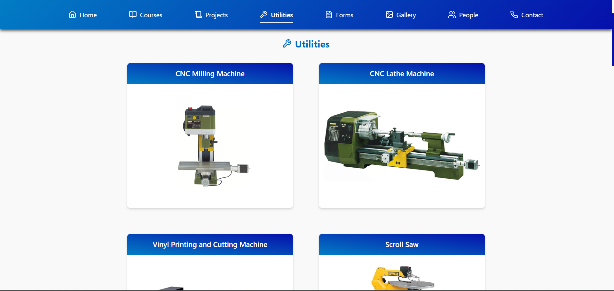
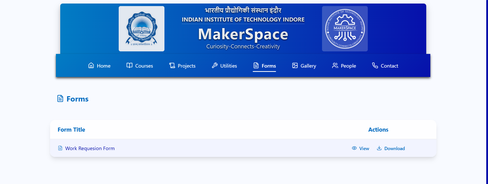
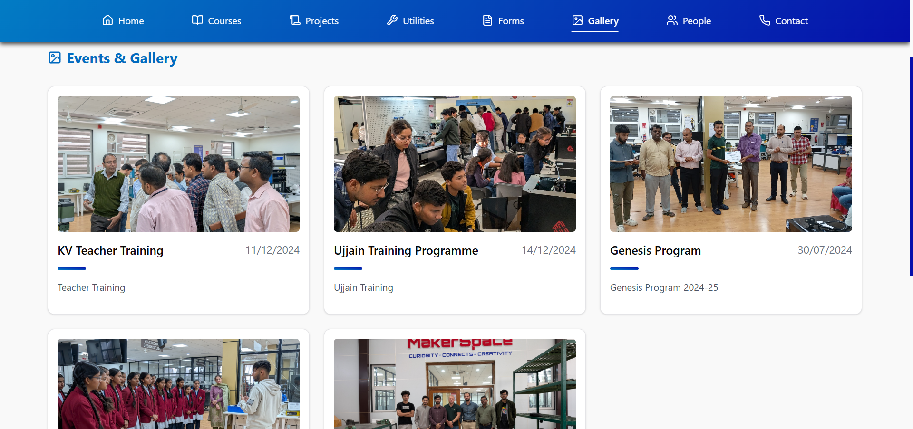
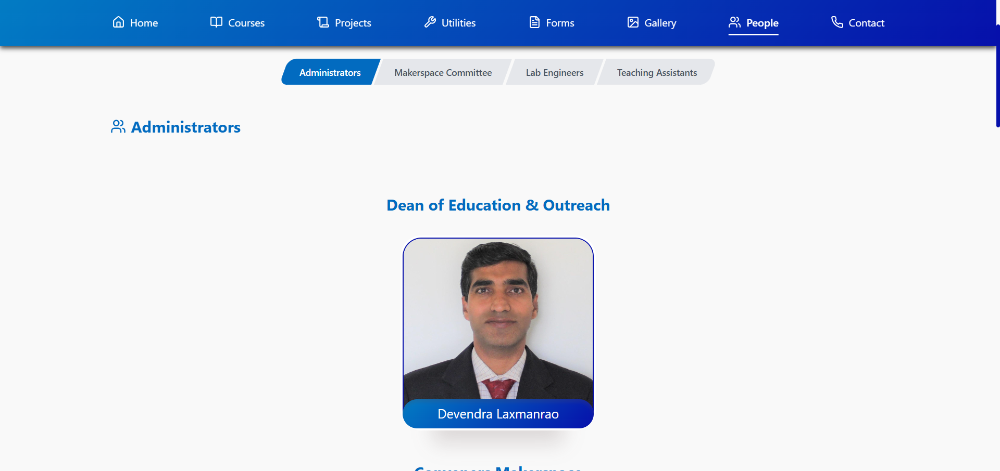
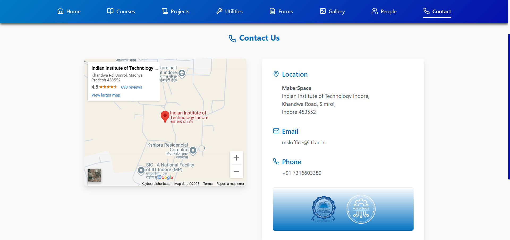

# 🚀 MakerSpace IIT Indore

> **Curiosity-Connects-Creativity**

MakerSpace IIT Indore is a platform that connects students, faculty, and resources to turn curiosity into creativity. It powers structured learning and hands-on making through curriculum courses, workshops, and skill development; showcases innovative projects; and streamlines equipment and administrative workflows — all in one place.

### Live site
- Visit: [Makerspace](http://makerspace.iiti.ac.in)

## 📸 See It In Action

### 🏠 **Homepage**

*The main entry point to MakerSpace with navigation to all sections and key information.*

### 🎓 **Course Management**

*Browse courses in three categories: Curriculum, Workshops & Training, and Skill Development.*

### 🔬 **Project Showcase**

*View student projects with faculty mentorship details and participant information.*

### 🛠️ **Utilities & Equipment**

*See all the available tools like CNC machines, vinyl cutter, and scroll saw.*

### 📋 **Administrative Forms**

*Submit work requests and track approvals for equipment usage and project work.*

### 🎨 **Events & Gallery**

*Check upcoming workshops and browse photos from past events and competitions.*

### 👥 **People & Administration**

*Meet the team - faculty mentors, lab engineers, and teaching assistants.*

### 📍 **Contact & Location**

*Find our location, contact details, and get directions to MakerSpace.*

## 🛠️ Tech Stack

### Frontend
- **Framework**: Next.js 15.0.3 (React 18)
- **Styling**: Tailwind CSS + Styled Components
- **UI Components**: Radix UI + Lucide React Icons
- **Animations**: Framer Motion
- **Language**: TypeScript

### Backend
- **Framework**: Django 4.2.6
- **Database**: SQLite (Development) / PostgreSQL (Production)
- **Authentication**: JWT + OAuth2 (Google)
- **API**: Django REST Framework
- **CORS**: django-cors-headers

### Infrastructure
- **Containerization**: Docker + Docker Compose
- **Web Server**: Nginx
- **Environment**: Python 3.11+ / Node.js 18+

## 📝 License

This project is developed for educational purposes at IIT Indore.
All rights reserved. Contact msloffice@iiti.ac.in for permissions.

## 📞 Support & Contact

- **Email**: msloffice@iiti.ac.in
- **Phone**: +91 7316603389
- **Location**: MakerSpace, IIT Indore, Khandwa Road, Simrol, Indore 453552
- **Website**: [makerspace.iiti.ac.in](http://makerspace.iiti.ac.in)

**Curiosity-Connects-Creativity**
